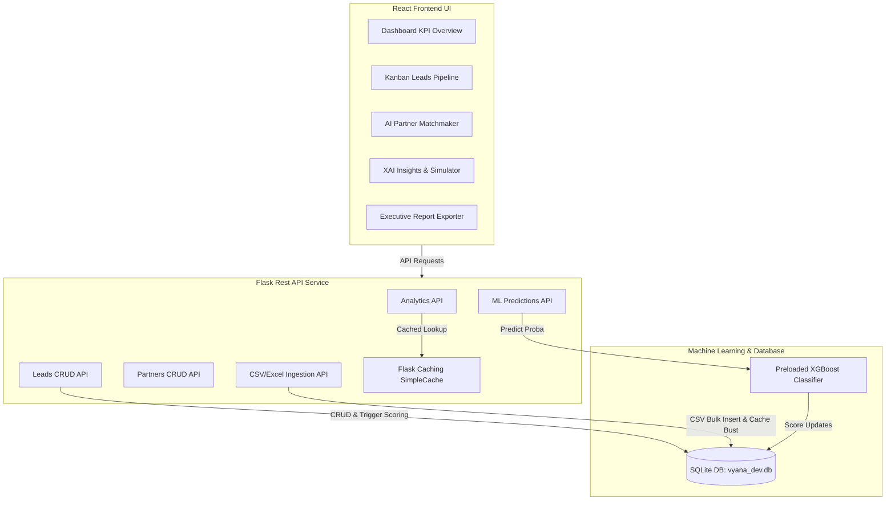

# Vyana AI: Channel Partner & Lead Intelligence Dashboard

Vyana AI is a corporate-grade, machine-learning-powered channel sales operations dashboard designed for **Vyana Innovations Pvt. Ltd.** It utilizes a tuned XGBoost classification model to evaluate incoming leads and match them with top-performing regional channel partners.

---

## 🛠️ Technology Stack

- **Backend**: Python 3.10+, Flask, SQLAlchemy (SQLite database), Marshmallow (validation)
- **Machine Learning**: Scikit-Learn, XGBoost, Pandas, Joblib
- **Frontend**: React 18, Vite, Tailwind CSS v3, Recharts, Lucide Icons, React Router v6
- **Performance & Cache**: Flask-Caching (SimpleCache memory store), React lazy-loading, component memoization

---

## 🏗️ Project Architecture



---

## 🚀 Installation & Quick Start

### 1. Backend Service Setup
1. Navigate to the backend directory:
   ```bash
   cd backend
   ```
2. Initialize virtual environment and install dependencies:
   ```bash
   python -m venv venv
   source venv/bin/activate  # On Windows: venv\Scripts\activate
   pip install -r requirements.txt
   ```
3. Initialize the SQLite database and seed initial mock records:
   ```bash
   python data/generate_sample_data.py
   ```
4. Start the Flask REST API server (on port 5000):
   ```bash
   flask run --port=5000
   ```

### 2. Frontend Dashboard Setup
1. Navigate to the frontend directory:
   ```bash
   cd ../frontend
   ```
2. Install npm packages:
   ```bash
   npm install
   ```
3. Start the Vite development server (on port 3000):
   ```bash
   npm run dev
   ```
4. Access the web application at `http://localhost:3000`.

---

## 📡 REST API Reference

### 1. Analytics & Summary
- **`GET /api/analytics/summary`**: Returns global stats (Active Partners, Active Leads, Conversion Rate, Pipeline Value). *Cached (300s)*.
- **`GET /api/analytics/trends`**: Returns 12-week trends of volume and conversion rate. *Cached (300s)*.
- **`GET /api/analytics/tier-breakdown`**: Returns partner distributions by Tier. *Cached (300s)*.

### 2. Lead Pipeline CRUD
- **`GET /api/leads`**: Lists leads with pagination and filters.
- **`POST /api/leads`**: Creates a new lead and calculates its ML score dynamically.
- **`PUT /api/leads/<id>`**: Updates lead variables (e.g. status, deal size) and triggers ML score recalculation.
- **`DELETE /api/leads/<id>`**: Deletes a lead.

### 3. File Ingestion Pipeline
- **`POST /api/upload/partners`**: Ingests partner CSV/Excel sheets. Supports empty file validation and in-file duplicate filtering.
- **`POST /api/upload/leads`**: Ingests leads CSV/Excel sheets.

### 4. Predictions & Scoring
- **`POST /api/predict/batch`**: Triggers batch re-scoring of SQLite leads.

---

## 🧪 Running Verification Tests
Run the test runner to verify all REST endpoints, validation schemas, database commits, and cache invalidation:
```bash
cd backend
venv/bin/python -m unittest tests/test_endpoints.py
```

---

## 👤 Project Metadata
- **Author**: Ansh Rohilla (AI & BI Intern)
- **Organization**: Vyana Innovations Pvt. Ltd.
- **Date**: July 2026
